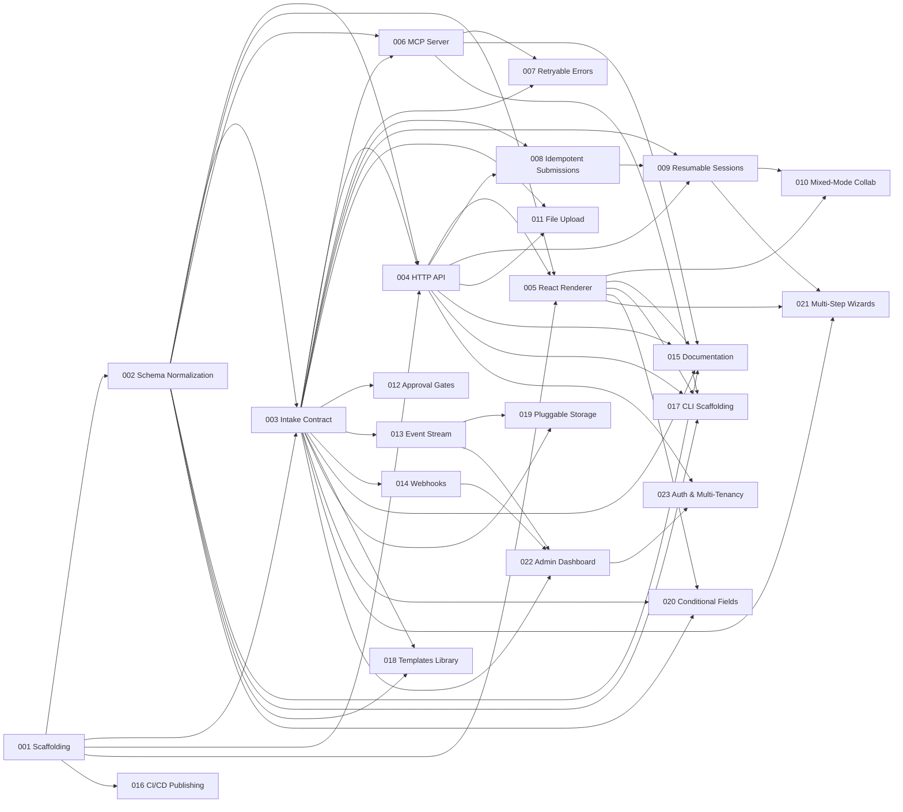

# FormBridge Feature Reference

FormBridge turns your Zod / JSON Schema / OpenAPI into agent-native intake: an embeddable web form for humans and an MCP tool for agents, backed by the same validation and destination. It provides structured retryable errors, idempotent and resumable submissions, upload negotiation, and optional human approval.

This document is the authoritative reference for all 23 FormBridge features across 5 phases. All 23 features are **implemented**.

---

## Status Summary

| # | Feature | Phase | Status | Priority | Complexity | Impact | Deps |
|-----|-----------------------------------------------|-------|-------------|----------|------------|--------|-----------------|
| 001 | Project Scaffolding & Build System | 1 | IMPLEMENTED | must | medium | high | -- |
| 002 | Schema Normalization Layer | 1 | IMPLEMENTED | must | high | high | 001 |
| 003 | Intake Contract Runtime & Validation Engine | 1 | IMPLEMENTED | must | high | high | 001, 002 |
| 004 | HTTP/JSON Submission API Server | 1 | IMPLEMENTED | must | medium | high | 001, 002, 003 |
| 005 | React Form Renderer | 1 | IMPLEMENTED | must | high | high | 001, 002, 004 |
| 006 | MCP Tool Server Generation | 2 | IMPLEMENTED | must | high | high | 002, 003 |
| 007 | Structured Retryable Error Protocol | 2 | IMPLEMENTED | must | medium | high | 003, 006 |
| 008 | Idempotent Submissions | 2 | IMPLEMENTED | must | medium | high | 003, 004 |
| 009 | Resumable Sessions with Resume Tokens | 2 | IMPLEMENTED | should | high | high | 003, 004, 008 |
| 010 | Mixed-Mode Agent-Human Collaboration | 3 | IMPLEMENTED | should | high | high | 005, 009 |
| 011 | File Upload Negotiation Protocol | 3 | IMPLEMENTED | should | high | medium | 003, 004 |
| 012 | Approval Gates & Review Workflow | 3 | IMPLEMENTED | should | medium | medium | 003 |
| 013 | Event Stream & Audit Trail | 3 | IMPLEMENTED | should | medium | medium | 003 |
| 014 | Webhook & Destination Forwarding | 3 | IMPLEMENTED | should | medium | high | 003 |
| 015 | Developer Documentation & API Reference | 4 | IMPLEMENTED | should | medium | high | 002, 003, 004, 005, 006 |
| 016 | npm Package Publishing & CI/CD Pipeline | 4 | IMPLEMENTED | should | medium | high | 001 |
| 017 | CLI Scaffolding Tool | 4 | IMPLEMENTED | could | medium | medium | 002, 004, 005, 006 |
| 018 | Example Intake Templates Library | 4 | IMPLEMENTED | could | low | medium | 002, 003 |
| 019 | Pluggable Storage Backends | 5 | IMPLEMENTED | could | medium | medium | 003, 013 |
| 020 | Conditional Fields & Dynamic Schema | 5 | IMPLEMENTED | could | medium | medium | 002, 003, 005 |
| 021 | Multi-Step Wizard Forms | 5 | IMPLEMENTED | could | medium | medium | 003, 005, 009 |
| 022 | Admin Dashboard | 5 | IMPLEMENTED | could | high | medium | 003, 013, 014 |
| 023 | Authentication, Authorization & Multi-Tenancy | 5 | IMPLEMENTED | could | high | medium | 004, 022 |

---

## Dependency Graph

---

## Phase 1: Foundation -- Core SDK Engine

Build the foundational SDK: project scaffolding, schema normalization, Intake Contract state machine, HTTP/JSON submission API, and React form renderer.

### 001 -- Project Scaffolding & Build System

| Field | Value |
|--------------|-------|
| **Status** | IMPLEMENTED |
| **Phase** | 1 |
| **Priority** | must |
| **Complexity**| medium |
| **Impact** | high |
| **Dependencies** | -- |
| **Breakdown** | [View breakdown](features/001-project-scaffolding-build-system.md) |

**Description**

Initialize the FormBridge monorepo with TypeScript configuration, package structure (@formbridge/core, @formbridge/react, @formbridge/mcp), build system (tsup or unbuild), test framework (Vitest), linting (ESLint + Prettier), and package.json scaffolding. Establish the foundational project architecture that all other features build upon.

**Rationale**

Nothing can be built without project infrastructure. The entire codebase is greenfield -- every other feature depends on having a properly configured monorepo with build tooling, type checking, and test runners in place.

**User Stories**

- As a contributor, I want to clone the repo and run `npm install && npm run build` so that I can start developing immediately.
- As a maintainer, I want consistent code formatting and linting so that contributions stay clean and reviewable.

**Acceptance Criteria**

- [x] Monorepo structure exists with @formbridge/core, @formbridge/react, and @formbridge/mcp packages
- [x] TypeScript compiles successfully across all packages with strict mode enabled
- [x] Vitest runs and reports results for placeholder test files
- [x] ESLint and Prettier are configured and pass on all source files
- [x] Build command produces ESM and CJS outputs for each package
- [x] Package.json files have correct dependencies, exports, and type definitions
- [x] All packages can import from each other via workspace references

---

### 002 -- Schema Normalization Layer

| Field | Value |
|--------------|-------|
| **Status** | IMPLEMENTED |
| **Phase** | 1 |
| **Priority** | must |
| **Complexity**| high |
| **Impact** | high |
| **Dependencies** | 001 |
| **Breakdown** | [View breakdown](features/002-schema-normalization-layer.md) |

**Description**

Build a schema normalization engine that accepts Zod schemas, JSON Schema documents, and OpenAPI specification fragments, and converts them into a unified internal representation (IntakeSchema IR). This IR captures field definitions, types, constraints, descriptions, required/optional status, nested objects, arrays, and enums.

**Rationale**

The "define once, use everywhere" promise requires a schema normalization layer. Unlike MCP elicitation (flat objects only) and OpenAPI-to-MCP wrappers (76.5% success rate), FormBridge produces validated, purpose-built internal representations.

**User Stories**

- As a developer, I want to define my intake schema in Zod so that I don't have to learn a new schema format.
- As a developer with existing JSON Schema definitions, I want to reuse them directly.
- As a developer with an existing OpenAPI spec, I want to point FormBridge at my spec.

**Acceptance Criteria**

- [x] Zod schemas parsed into IntakeSchema IR preserving all field metadata
- [x] JSON Schema (draft-07/2020-12) parsed into same IR
- [x] OpenAPI 3.0/3.1 request body schemas extracted and parsed
- [x] Nested objects and arrays fully supported
- [x] Enum types with labels preserved
- [x] Required vs optional fields correctly represented
- [x] Field descriptions and examples carried through
- [x] Invalid/unsupported constructs produce clear errors
- [x] Round-trip test: IR serializable back to JSON Schema
- [x] At least 50 test cases

---

### 003 -- Intake Contract Runtime & Validation Engine

| Field | Value |
|--------------|-------|
| **Status** | IMPLEMENTED |
| **Phase** | 1 |
| **Priority** | must |
| **Complexity**| high |
| **Impact** | high |
| **Dependencies** | 001, 002 |
| **Breakdown** | [View breakdown](features/003-intake-contract-runtime-validation-engine.md) |

**Description**

Core Intake Contract runtime: submission state machine (draft, validating, accepted, rejected, needs_review, approved, forwarded) with validation engine producing structured, typed errors categorized by type (missing, invalid, conflict, needs_approval).

**Rationale**

FormBridge's core differentiator. Every competitor lacks a submission state machine. Structured error taxonomy designed for agent consumption.

**User Stories**

- As an AI agent, I want structured errors with field paths and error types so I can programmatically retry.
- As a developer, I want well-defined submission lifecycle states.
- As operations, I want to see submission state for troubleshooting.

**Acceptance Criteria**

- [x] State machine enforces valid transitions
- [x] Invalid transitions throw clear errors
- [x] Validation engine accepts IntakeSchema IR + submission data, returns structured results
- [x] Errors include: type, field path, message, code, suggested fix
- [x] Missing/invalid/conflict error types properly categorized
- [x] State machine is serializable
- [x] State transitions emit typed events
- [x] At least 80 test cases

---

### 004 -- HTTP/JSON Submission API Server

| Field | Value |
|--------------|-------|
| **Status** | IMPLEMENTED |
| **Phase** | 1 |
| **Priority** | must |
| **Complexity**| medium |
| **Impact** | high |
| **Dependencies** | 001, 002, 003 |
| **Breakdown** | [View breakdown](features/004-http-json-submission-api-server.md) |

**Description**

HTTP/JSON API server exposing intake definitions as REST endpoints. POST/GET/PATCH submissions with structured error format. Embeddable as middleware.

**Rationale**

Universal submission interface. Typeform has no programmatic API; Jotform API submissions are second-class.

**User Stories**

- As a developer, mount FormBridge API as middleware in existing Express/Hono app.
- As an AI agent without MCP, submit via HTTP POST.
- As a frontend developer, fetch intake schema via GET.

**Acceptance Criteria**

- [x] POST /intake/:id/submissions creates submissions
- [x] GET /intake/:id/submissions/:submissionId returns status
- [x] PATCH updates draft submissions
- [x] GET /intake/:id/schema returns JSON Schema
- [x] Structured error responses
- [x] Exportable as Express/Hono middleware
- [x] CORS configurable
- [x] Health check at GET /health

---

### 005 -- React Form Renderer

| Field | Value |
|--------------|-------|
| **Status** | IMPLEMENTED |
| **Phase** | 1 |
| **Priority** | must |
| **Complexity**| high |
| **Impact** | high |
| **Dependencies** | 001, 002, 004 |
| **Breakdown** | [View breakdown](features/005-react-form-renderer.md) |

**Description**

Embeddable React component auto-rendering web forms from IntakeSchema IR. Maps field types to controls, handles client-side validation, displays server errors, submits to HTTP API.

**Rationale**

Human side of dual-interface. Unlike Retool (can't export standalone) or Form.io (not production-ready), FormBridge's renderer is portable.

**User Stories**

- As a developer, embed a form with a single component.
- As a user, get clear inline validation feedback.
- As a developer, customize appearance with CSS.

**Acceptance Criteria**

- [x] Component accepts IntakeSchema IR and renders form
- [x] String/number/boolean/enum/array/object fields rendered appropriately
- [x] Required fields visually indicated
- [x] Client-side validation on blur and submit
- [x] Server-side errors displayed inline
- [x] Embeddable in React 18+
- [x] Default minimal styling with className overrides
- [x] Fully accessible (ARIA, keyboard, screen reader)

---

## Phase 2: Agent-Native Integration

MCP tool server generation, structured retryable errors, idempotent submissions, and resumable sessions.

### 006 -- MCP Tool Server Generation

| Field | Value |
|--------------|-------|
| **Status** | IMPLEMENTED |
| **Phase** | 2 |
| **Priority** | must |
| **Complexity**| high |
| **Impact** | high |
| **Dependencies** | 002, 003 |
| **Breakdown** | [View breakdown](features/006-mcp-tool-server-generation.md) |

**Description**

Auto-generate MCP tool server from IntakeSchema. Each form exposed as MCP tool for AI agents. Supports stdio and SSE transports.

**Rationale**

Most differentiating feature. No form/intake tool provides agent-native submission. Typeform has no API, Retool has no agent interface, Form.io has no agent protocol, Jotform blocks bots.

**User Stories**

- As a developer, generate MCP server from Zod schema.
- As an AI agent, discover intake forms as MCP tools.
- As a platform engineer, expose forms to agents without custom wrappers.

**Acceptance Criteria**

- [x] SDK generates complete MCP tool server from IntakeSchema
- [x] Each form appears as named MCP tool
- [x] Descriptions include field constraints
- [x] Agent receives structured validation results
- [x] stdio and SSE transports supported
- [x] tools/list returns full metadata
- [x] MCP protocol compliance
- [x] 10+ field schema generates tool in under 100ms

---

### 007 -- Structured Retryable Error Protocol

| Field | Value |
|--------------|-------|
| **Status** | IMPLEMENTED |
| **Phase** | 2 |
| **Priority** | must |
| **Complexity**| medium |
| **Impact** | high |
| **Dependencies** | 003, 006 |
| **Breakdown** | [View breakdown](features/007-structured-retryable-error-protocol.md) |

**Description**

Purpose-built error protocol for LLM agent retry loops. Every error includes category, field path, message, code, constraints, and correction hint.

**Rationale**

Most technically novel aspect. No existing tool provides machine-parseable error categories for agents.

**User Stories**

- As an AI agent, get structured errors with field paths and hints.
- As a developer, get deterministic error codes.
- As an LLM, get context to converge to valid submission.

**Acceptance Criteria**

- [x] Every error includes: category, field_path, message, code, hint
- [x] Missing/invalid/conflict/needs_approval error details
- [x] Error summary with count and categories
- [x] LLM can correct in single retry for common patterns
- [x] Error protocol identical across HTTP and MCP
- [x] Error codes are stable strings
- [x] Documentation includes retry loop pseudocode

---

### 008 -- Idempotent Submissions

| Field | Value |
|--------------|-------|
| **Status** | IMPLEMENTED |
| **Phase** | 2 |
| **Priority** | must |
| **Complexity**| medium |
| **Impact** | high |
| **Dependencies** | 003, 004 |
| **Breakdown** | [View breakdown](features/008-idempotent-submissions.md) |

**Description**

Idempotency key support. Clients include Idempotency-Key header; duplicate keys return original response without reprocessing.

**Rationale**

Agents frequently retry; without idempotency, retries create duplicates. No form builder provides idempotency keys.

**User Stories**

- As an AI agent, safely retry without duplicates.
- As a developer, get idempotency built-in.
- As operations, know if submission was original or replay.

**Acceptance Criteria**

- [x] Optional Idempotency-Key header or MCP metadata
- [x] Duplicate keys return original response (200 not 201)
- [x] Keys scoped per intake definition
- [x] Pluggable storage (in-memory default)
- [x] Configurable TTL (default 24h)
- [x] Concurrent requests handled safely
- [x] Idempotent-Replayed header on cached responses

---

### 009 -- Resumable Sessions with Resume Tokens

| Field | Value |
|--------------|-------|
| **Status** | IMPLEMENTED |
| **Phase** | 2 |
| **Priority** | should |
| **Complexity**| high |
| **Impact** | high |
| **Dependencies** | 003, 004, 008 |
| **Breakdown** | [View breakdown](features/009-resumable-sessions-with-resume-tokens.md) |

**Description**

Resumable submissions via opaque resume tokens with optimistic concurrency (ETag-style versioning). Any client can retrieve and continue a submission.

**Rationale**

Solves MCP elicitation timeout flaw and enables pause-gather-resume workflows.

**User Stories**

- As an AI agent, save partial progress and resume later.
- As an agent, hand resume URL to a human for completion.
- As a developer, get optimistic concurrency for concurrent edits.

**Acceptance Criteria**

- [x] Draft submissions return resume token
- [x] Token enables GET (retrieve) and PATCH (update)
- [x] ETag-style version for concurrency
- [x] Stale version returns 409 Conflict
- [x] Opaque, non-guessable tokens
- [x] Configurable expiration (default 7 days)
- [x] Expired tokens return 410 Gone
- [x] Works without authentication
- [x] MCP supports resume token passing

---

## Phase 3: Production Hardening

Mixed-mode collaboration, file upload negotiation, approval gates, event stream audit trail, and webhook forwarding.

### 010 -- Mixed-Mode Agent-Human Collaboration

| Field | Value |
|--------------|-------|
| **Status** | IMPLEMENTED |
| **Phase** | 3 |
| **Priority** | should |
| **Complexity**| high |
| **Impact** | high |
| **Dependencies** | 005, 009 |
| **Breakdown** | [View breakdown](features/010-mixed-mode-agent-human-collaboration.md) |

**Description**

Agent starts submission, fills known fields, generates shareable resume URL for human to complete. Same submission record with full attribution tracking.

**Rationale**

No product supports agent fills 80% + human completes 20% on same submission. Hallmark FormBridge use case.

**User Stories**

- As an AI agent, fill vendor data then hand off to human for uploads.
- As a human reviewer, see which fields the agent filled.
- As a compliance officer, know data provenance (agent vs human).

**Acceptance Criteria**

- [x] Agent fills fields, receives shareable resume URL
- [x] Human sees pre-filled form
- [x] Agent-filled fields visually distinguished
- [x] Submission tracks which actor filled each field
- [x] Same validation pipeline for both
- [x] Resume URL single-use or time-limited
- [x] Agent notified when human completes

---

### 011 -- File Upload Negotiation Protocol

| Field | Value |
|--------------|-------|
| **Status** | IMPLEMENTED |
| **Phase** | 3 |
| **Priority** | should |
| **Complexity**| high |
| **Impact** | medium |
| **Dependencies** | 003, 004 |
| **Breakdown** | [View breakdown](features/011-file-upload-negotiation-protocol.md) |

**Description**

Clients declare upload intent, receive signed URLs with constraints, upload directly to storage, link files to submission. Pluggable storage backends.

**Rationale**

MCP elicitation has no file upload. Enterprise workflows need document uploads.

**User Stories**

- As an AI agent, negotiate uploads with signed URLs.
- As a human, drag and drop files.
- As a developer, declare constraints in schema.

**Acceptance Criteria**

- [x] File field types with constraints in schema
- [x] POST endpoint initiates upload negotiation
- [x] Signed URLs returned
- [x] Direct upload to storage
- [x] Upload completion tracking
- [x] React file upload component with drag-drop
- [x] Local filesystem and S3 backends

---

### 012 -- Approval Gates & Review Workflow

| Field | Value |
|--------------|-------|
| **Status** | IMPLEMENTED |
| **Phase** | 3 |
| **Priority** | should |
| **Complexity**| medium |
| **Impact** | medium |
| **Dependencies** | 003 |
| **Breakdown** | [View breakdown](features/012-approval-gates-review-workflow.md) |

**Description**

Human approval gates as state machine transitions. Reviewers approve, reject, or request changes. Works identically for agent and human submissions.

**Rationale**

Enterprise governance for agent-submitted data. No tool provides approval gates for both agent and human submissions.

**User Stories**

- As a compliance officer, review agent-submitted vendor data.
- As an AI agent, know when submission needs approval.
- As a reviewer, see full submission context.

**Acceptance Criteria**

- [x] approval_required: true in intake definition
- [x] Validation leads to needs_review instead of accepted
- [x] Approve/reject/request-changes actions
- [x] Events recorded in event stream
- [x] Reviewer notifications
- [x] Approval UI in React renderer
- [x] Sequential approval levels

---

### 013 -- Event Stream & Audit Trail

| Field | Value |
|--------------|-------|
| **Status** | PLANNED |
| **Phase** | 3 |
| **Priority** | should |
| **Complexity**| medium |
| **Impact** | medium |
| **Dependencies** | 003 |
| **Breakdown** | [View breakdown](features/013-event-stream-audit-trail.md) |

**Description**

Append-only immutable event stream recording every state transition, validation result, actor action. Typed events with timestamps, actor identification, full payloads.

**Rationale**

Enterprise compliance-grade audit trails. No intake tool provides typed event streams.

**User Stories**

- As a compliance officer, get complete audit trail.
- As a developer, see full event sequence for debugging.
- As operations, track agent-human interactions.

**Acceptance Criteria**

- [ ] Every transition emits typed event
- [ ] Events include type, timestamp, actor, payload, version
- [ ] Append-only (no modify/delete)
- [ ] GET endpoint returns full event stream
- [ ] Filterable by type, actor, time
- [ ] Field-level diffs for updates
- [ ] Serializable for export
- [ ] Pluggable storage

---

### 014 -- Webhook & Destination Forwarding

| Field | Value |
|--------------|-------|
| **Status** | PLANNED |
| **Phase** | 3 |
| **Priority** | should |
| **Complexity**| medium |
| **Impact** | high |
| **Dependencies** | 003 |
| **Breakdown** | [View breakdown](features/014-webhook-destination-forwarding.md) |

**Description**

Auto-forward accepted/approved submissions to webhook URLs with retry, HMAC-SHA256 signing, delivery tracking.

**Rationale**

Jotform webhooks don't fire for API submissions. FormBridge treats all sources equally.

**User Stories**

- As a developer, auto-send accepted submissions to my API.
- As a platform engineer, verify payloads with webhook signing.
- As operations, track delivery status.

**Acceptance Criteria**

- [ ] Configure destination webhook URLs
- [ ] Auto-forward as JSON POST
- [ ] HMAC-SHA256 signature header
- [ ] Exponential backoff retries (default 5)
- [ ] Delivery tracking (pending/delivered/failed)
- [ ] Identical for all submission sources
- [ ] Dry-run mode
- [ ] Custom headers per destination

---

## Phase 4: Developer Experience & Adoption

Documentation, npm publishing CI/CD, CLI scaffolding, and example templates.

### 015 -- Developer Documentation & API Reference

| Field | Value |
|--------------|-------|
| **Status** | PLANNED |
| **Phase** | 4 |
| **Priority** | should |
| **Complexity**| medium |
| **Impact** | high |
| **Dependencies** | 002, 003, 004, 005, 006 |
| **Breakdown** | [View breakdown](features/015-developer-documentation-api-reference.md) |

**Description**

Quickstart guide, SDK API reference, schema guide, Intake Contract spec reference, MCP guide, React docs, example walkthroughs. Static site.

**Rationale**

Form.io's biggest complaint is poor docs. Documentation is the primary acquisition channel for OSS SDKs.

**User Stories**

- As a developer, evaluate FormBridge in 5 minutes via quickstart.
- As a developer, look up API signatures.
- As a developer, get MCP integration guide.

**Acceptance Criteria**

- [ ] 10-minute quickstart guide
- [ ] Full API reference across packages
- [ ] Zod/JSON Schema/OpenAPI examples
- [ ] State diagrams and error taxonomy reference
- [ ] MCP integration guide
- [ ] React component API docs
- [ ] 3+ end-to-end walkthroughs
- [ ] All code examples tested
- [ ] Documentation site deployed
- [ ] Search functionality

---

### 016 -- npm Package Publishing & CI/CD Pipeline

| Field | Value |
|--------------|-------|
| **Status** | PLANNED |
| **Phase** | 4 |
| **Priority** | should |
| **Complexity**| medium |
| **Impact** | high |
| **Dependencies** | 001 |
| **Breakdown** | [View breakdown](features/016-npm-package-publishing-ci-cd-pipeline.md) |

**Description**

Automated CI/CD: GitHub Actions for lint/type-check/test/build/publish. Semver, TypeScript declarations, ESM/CJS, provenance attestation, changelog generation.

**Rationale**

Bridge between internal development and community adoption.

**User Stories**

- As a developer, install from npm.
- As a contributor, CI catches issues on PR.
- As a maintainer, automated publishing.

**Acceptance Criteria**

- [ ] GitHub Actions on every PR
- [ ] ESM/CJS with TypeScript declarations
- [ ] Automated npm publish on tagged releases
- [ ] Provenance attestation
- [ ] Conventional commit changelog
- [ ] Semver enforcement
- [ ] @formbridge scope
- [ ] Package size tracking
- [ ] Integration tests against real MCP/HTTP

---

### 017 -- CLI Scaffolding Tool

| Field | Value |
|--------------|-------|
| **Status** | PLANNED |
| **Phase** | 4 |
| **Priority** | could |
| **Complexity**| medium |
| **Impact** | medium |
| **Dependencies** | 002, 004, 005, 006 |
| **Breakdown** | [View breakdown](features/017-cli-scaffolding-tool.md) |

**Description**

`npx @formbridge/create` scaffolds new project with interactive prompts for schema format, interfaces, and templates.

**Rationale**

Standard onboarding pattern for modern JS/TS libraries.

**User Stories**

- As a developer, scaffold working project in one command.
- As a developer, pick matching template.
- As a team lead, get standard project structure.

**Acceptance Criteria**

- [ ] Interactive setup wizard
- [ ] Schema format selection
- [ ] Interface multi-select
- [ ] Template selection
- [ ] Generated project runs with `npm run dev`
- [ ] README with next steps
- [ ] Non-interactive mode for CI
- [ ] Under 10 seconds

---

### 018 -- Example Intake Templates Library

| Field | Value |
|--------------|-------|
| **Status** | PLANNED |
| **Phase** | 4 |
| **Priority** | could |
| **Complexity**| low |
| **Impact** | medium |
| **Dependencies** | 002, 003 |
| **Breakdown** | [View breakdown](features/018-example-intake-templates-library.md) |

**Description**

Pre-built real-world intake templates with complete schemas, configurations, and walkthroughs.

**Rationale**

Templates reduce time-to-value. Each includes both human form and MCP tool config.

**User Stories**

- As a developer, use template for vendor onboarding.
- As a developer evaluating, see real-world examples.
- As a team lead, ship intake workflows faster.

**Acceptance Criteria**

- [ ] At least 5 templates (vendor onboarding, IT access, customer intake, expense report, bug report)
- [ ] Zod schema + JSON Schema equivalent per template
- [ ] Importable as npm packages or copy-pasteable
- [ ] Documented walkthroughs

---

## Phase 5: Enterprise & Scale

Pluggable storage, conditional fields, multi-step wizards, admin dashboard, and auth/multi-tenancy.

### 019 -- Pluggable Storage Backends

| Field | Value |
|--------------|-------|
| **Status** | PLANNED |
| **Phase** | 5 |
| **Priority** | could |
| **Complexity**| medium |
| **Impact** | medium |
| **Dependencies** | 003, 013 |
| **Breakdown** | [View breakdown](features/019-pluggable-storage-backends.md) |

**Description**

Storage backend abstraction for submissions, events, tokens, files. In-memory, SQLite, S3-compatible. Published interface for community adapters.

**Rationale**

Works in diverse deployments. Essential for hosted tier.

**User Stories**

- Use in-memory for development.
- Use PostgreSQL in production.
- Swappable backend.

**Acceptance Criteria**

- [ ] Clear TypeScript types for all operations
- [ ] In-memory, SQLite, S3 backends
- [ ] Single constructor parameter config
- [ ] All backends pass same test suite
- [ ] Interface exported for community
- [ ] Migration utility
- [ ] Performance characteristics documented

---

### 020 -- Conditional Fields & Dynamic Schema

| Field | Value |
|--------------|-------|
| **Status** | PLANNED |
| **Phase** | 5 |
| **Priority** | could |
| **Complexity**| medium |
| **Impact** | medium |
| **Dependencies** | 002, 003, 005 |
| **Breakdown** | [View breakdown](features/020-conditional-fields-dynamic-schema.md) |

**Description**

Conditional field logic: show/hide, required/optional, validation rules based on other field values. Declarative conditions evaluated client and server side.

**Rationale**

Real-world forms need conditional logic. Deepens advantage over MCP elicitation (flat only).

**User Stories**

- Show fields based on selection.
- Agent understands field dependencies.
- Declarative conditions in schema.

**Acceptance Criteria**

- [ ] Conditional visibility, required, and validation rules
- [ ] Declarative in IntakeSchema IR
- [ ] Client-side evaluation in React
- [ ] Server-side evaluation in validator
- [ ] MCP descriptions include conditional hints
- [ ] Nested conditions supported
- [ ] Circular dependency detection

---

### 021 -- Multi-Step Wizard Forms

| Field | Value |
|--------------|-------|
| **Status** | PLANNED |
| **Phase** | 5 |
| **Priority** | could |
| **Complexity**| medium |
| **Impact** | medium |
| **Dependencies** | 003, 005, 009 |
| **Breakdown** | [View breakdown](features/021-multi-step-wizard-forms.md) |

**Description**

Split forms into wizard steps. Step boundaries in schema, one step displayed at a time, independent validation per step.

**Rationale**

Complex workflows with 20-30+ fields benefit from step-by-step flow.

**User Stories**

- As a user, steps prevent overwhelm.
- As an agent, submit step by step.
- As a developer, define steps in schema.

**Acceptance Criteria**

- [ ] Step definitions in schema
- [ ] One step at a time with navigation
- [ ] Progress indicator
- [ ] Independent step validation
- [ ] Back navigation preserves data
- [ ] HTTP/MCP step-level partial validation
- [ ] Step events in audit trail
- [ ] Conditional step visibility

---

### 022 -- Admin Dashboard

| Field | Value |
|--------------|-------|
| **Status** | PLANNED |
| **Phase** | 5 |
| **Priority** | could |
| **Complexity**| high |
| **Impact** | medium |
| **Dependencies** | 003, 013, 014 |
| **Breakdown** | [View breakdown](features/022-admin-dashboard.md) |

**Description**

Web-based admin dashboard: intake management, submission browser, event viewer, webhook monitoring, approval queue, analytics.

**Rationale**

Centerpiece of hosted tiers. Visual interface for non-developer users.

**User Stories**

- As operations, monitor submissions.
- As compliance, audit event streams.
- As team lead, analytics on agent vs human.

**Acceptance Criteria**

- [ ] Intake definition listing
- [ ] Submission search/filter/sort
- [ ] Full submission view with events and delivery status
- [ ] Approval queue with one-click actions
- [ ] Webhook delivery monitor
- [ ] Analytics (volume, breakdown, completion rates)
- [ ] React-based, responsive
- [ ] Authentication required

---

### 023 -- Authentication, Authorization & Multi-Tenancy

| Field | Value |
|--------------|-------|
| **Status** | PLANNED |
| **Phase** | 5 |
| **Priority** | could |
| **Complexity**| high |
| **Impact** | medium |
| **Dependencies** | 004, 022 |
| **Breakdown** | [View breakdown](features/023-authentication-authorization-multi-tenancy.md) |

**Description**

API key auth, OAuth/OIDC, RBAC (admin/reviewer/viewer), multi-tenancy with data isolation.

**Rationale**

Enterprise access controls. Retool locks SSO behind enterprise tier.

**User Stories**

- As a platform engineer, scoped API keys.
- As an enterprise admin, SSO.
- As SaaS operator, multi-tenancy.

**Acceptance Criteria**

- [ ] API key authentication
- [ ] Scoped keys per intake definition
- [ ] OAuth 2.0/OIDC for SSO
- [ ] RBAC with 3+ roles
- [ ] Multi-tenancy with data isolation
- [ ] Rate limiting per key
- [ ] Auth optional (disable for dev)
- [ ] Audit events include actor identity
